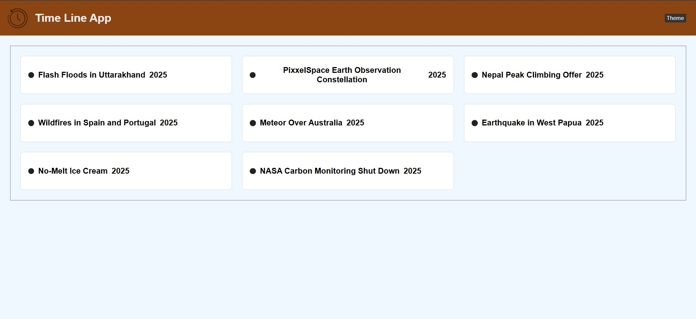
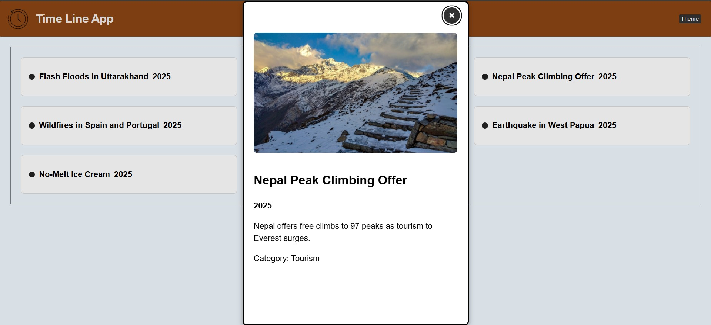
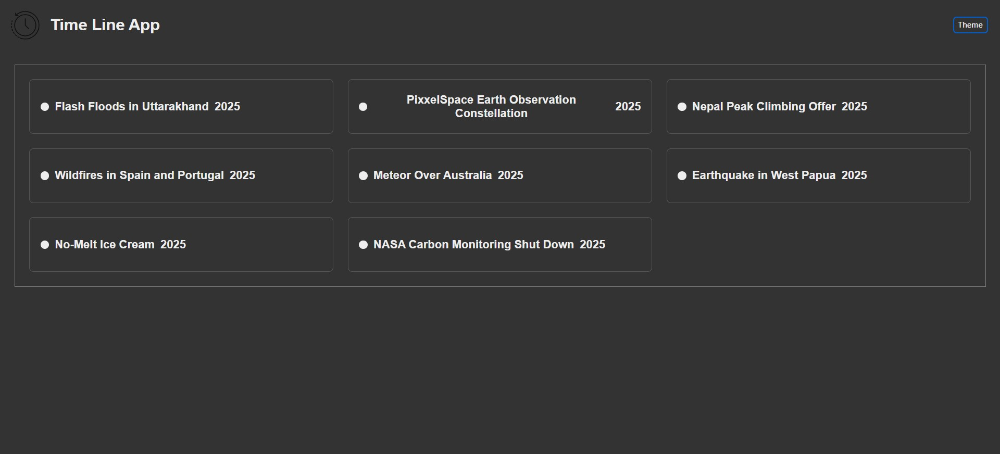
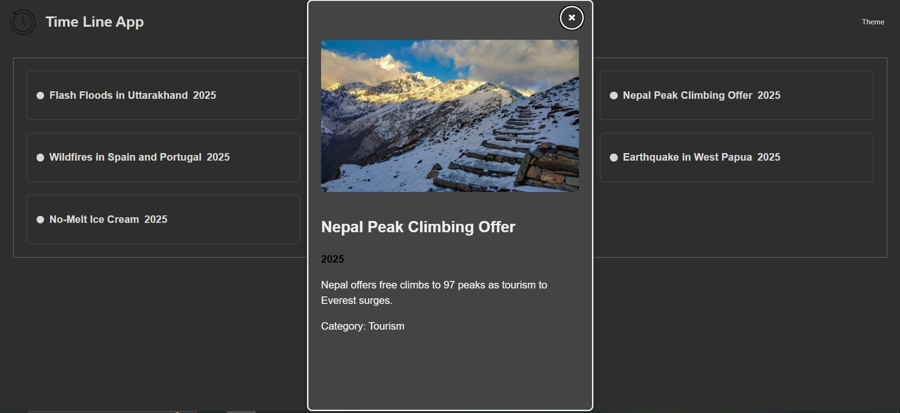

# Time Line Application ⏳
A fully responsive and accessible timeline application built with React and TypeScript. This project displays a series of events in a clean, modern interface, featuring a dark/light theme toggle and a detailed modal view for each event.

# Project Screenshots

## 🌞 Light Mode
### Without Modal

### With Modal

---

## 🌙 Dark Mode
### Without Modal

### With Modal

✨ Key Features & Screenshots
This application includes a range of features designed for a great user experience and accessibility.

Light Mode	Dark Mode
Main timeline view in light mode.	Main timeline view in dark mode.

Event Modal (Light)	Event Modal (Dark)
Detailed event view in a modal.	Modal is fully themed for dark mode.

Dynamic Event Timeline: Events are displayed in a responsive grid that adapts to different screen sizes.

Detailed Modal View: Clicking an event opens a modal with more information, including a description, category, and image.

Dark/Light Theme: A theme toggle button allows users to switch between a light and a high-contrast dark mode.

Fully Accessible: Built with accessibility in mind, meeting WCAG 2.1 AA standards.

♿ Accessibility Statement
This project was built to be inclusive and accessible to all users. Key accessibility features include:

✅ WCAG 2.1 AA Color Contrast: All text and UI elements meet the minimum 4.5:1 contrast ratio in both light and dark modes. Through rigorous testing, we ensured that both modes are fully readable and pass WCAG AA standards.

✅ Full Keyboard Navigation: All interactive elements, including the theme toggle, timeline markers, and modal controls, are fully accessible and operable using only a keyboard.

✅ Visible Focus Indicators: Clear and consistent focus outlines ensure keyboard users always know their location on the page.

✅ Semantic HTML: Uses semantic elements like <dialog> and <header> for improved screen reader support.

✅ Reduced Motion: Honors the prefers-reduced-motion media query to disable animations for users who are sensitive to motion.

For a full report on accessibility changes, see the ACCESSIBILITY.md file.

🛠️ Tech Stack
React: A JavaScript library for building user interfaces.

TypeScript: A typed superset of JavaScript that compiles to plain JavaScript.

CSS Modules / Plain CSS: For component-level and global styling.

Vite: A modern frontend build tool.

npm install
Start the development server:

Bash

npm run dev
The application will be available at http://localhost:5173.
